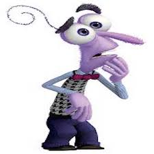

<h3 align="center">Voice Emotion Recognition</h3>

### Palette Theory:

Joy | Sadness | Anger | Disgust | Fear | Surprise
|:--: | :--: | :--: | :--: | :--: | :--: |
 |  |  |  |  | 

---

## Papers: 

Paper | Results | Limitations | Future Work
:--: | :--: | :--: | :--:
[EmoVoice — A framework for online recognition of emotions from voice](https://github.com/AmrMKayid/ResearchPapers/tree/master/Affective%20Computing/EmoVoice/Vogtetal-PIT08.pdf) | [] | [] | []
